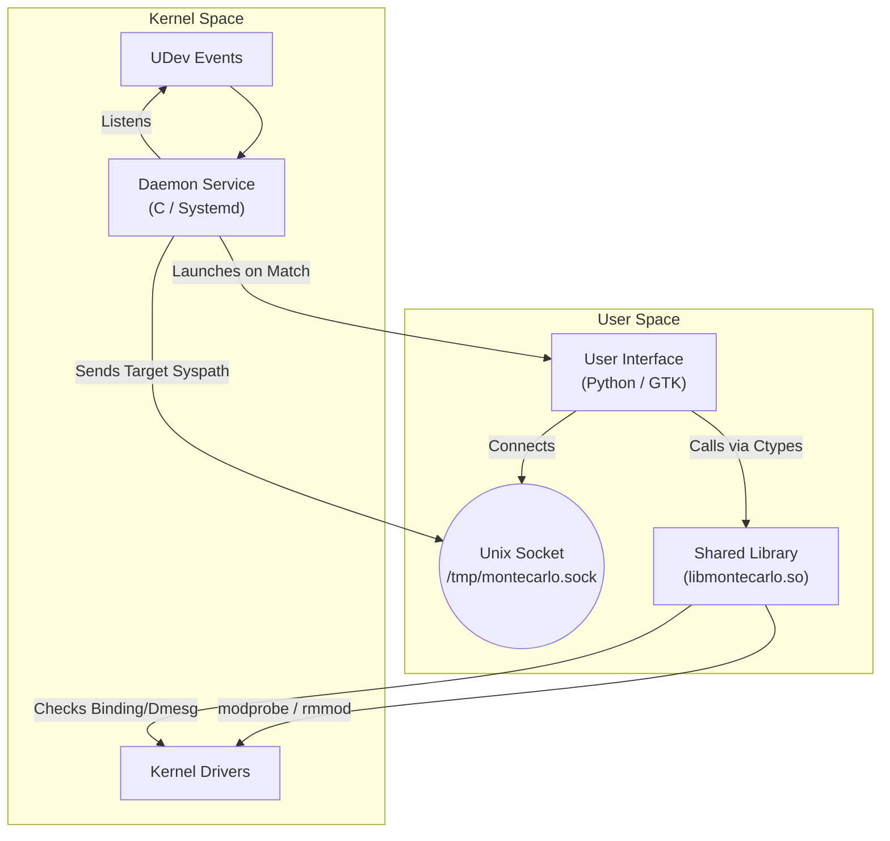

# Monte Carlo Driver Manager

Monte Carlo is an automated driver management tool for Linux, designed to detect devices without drivers and sequentially test candidate drivers until a match is found.

## Architecture

The system consists of three main components: a C Daemon, a Python UI, and a Shared Library.



## The Pipeline

1.  **Detection**: The Daemon monitors UDev for new USB/HID devices.
2.  **Verification**: It checks `libmontecarlo` to see if the device already has a driver bound.
3.  **Trigger**: If no driver is found, the Daemon launches the Python UI and passes the device path via Unix Socket.
4.  **Monte Carlo Process**:
    *   The UI calls the shared library to list candidate drivers.
    *   It iterates through the list sequentially:
        1.  **Load**: `modprobe <driver>`
        2.  **Wait**: Sleep for kernel registration.
        3.  **Check**: Verify if the device bound to the driver or generated kernel logs (dmesg).
        4.  **Action**:
            *   **Success**: Keep driver loaded, cache result, and stop.
            *   **Failure**: Unload driver (`modprobe -r`) and try the next one.

## License

This project is licensed under the **GNU General Public License v3.0 (GPLv3)**.

## Installation and Testing

### Prerequisites
*   `gcc`, `make`
*   `libudev-dev`
*   `python3`, `python3-gi` (GTK3)

### Build
```bash
# Clone the repository
git clone https://github.com/YourUsername/Montecarlo.git
cd Montecarlo

# Build Daemon and Shared Library
make
```

### Local Testing
To test the pipeline without installing the service system-wide:

1.  **Start the Daemon**:
    ```bash
    sudo ./montecarlo-daemon
    ```
    *The daemon will print "Listening on /tmp/montecarlo.sock".*

2.  **Simulate UI (or wait for device insertion)**:
    If you don't have a device to trigger the daemon, you can launch the UI manually for testing (requires root for driver operations):
    ```bash
    sudo python3 ui.py [syspath_to_debug]
    ```
    *If triggered by Daemon, it will launch automatically.*
