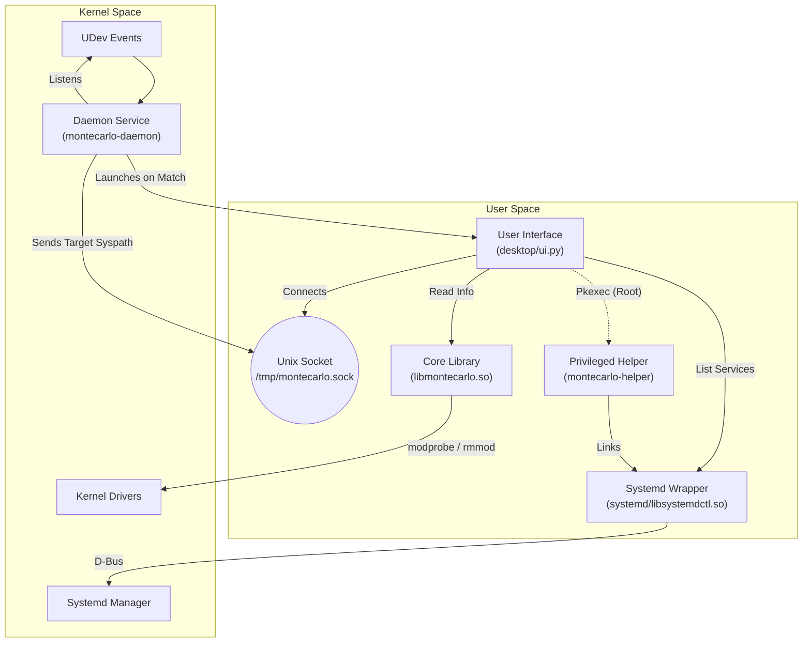

# Montecarlo Driver Manager

Montecarlo is an advanced, automated driver management tool for Linux. It abstracts the complexity of kernel modules, allowing users to probe, load, and manage USB drivers safely and efficiently.

It is designed to detect devices without drivers and help users find the correct module, while actively preventing system instability through rigorous safety checks.

---

## Key Features

### 🛡️ Active Safety System
Montecarlo prioritizes system stability.
*   **Dependency Protection**: Before unloading a module, it checks for dependent modules (holders) and blocks the action if it would break other drivers.
*   **Hardware Locking**: It detects if a driver is currently controlling active hardware (e.g., your mouse or keyboard) and prevents accidental unloading.

### 🧠 Smart Dashboard
The dashboard provides a clean, noise-free view of your system.
*   **Intelligent Filtering**: Automatically hides internal kernel dependencies, showing only the "Root Modules" that you actually installed or loaded.
*   **Status Indicators**: Clearly marks drivers as `(In Use)` or `(Idle)` with distinct icons.

---

## User Interface

### 1. The Dashboard
Your command center. View all loaded USB drivers in real-time. The list is filtered to remove kernel noise, focusing on the drivers that matter.


*Active drivers are verified against hardware bindings.*

### 2. Available Modules (Repository)
Don't know which driver to use? Browse your kernel's native module repository. You can search, filter, and load drivers dynamically to test compatibility.


*Search and load drivers specific to your kernel version.*

### 3. System Services (New)
Manage your standard linux services transparently. Montecarlo integrates with Systemd to show you what's running, failed, or inactive.
*   **Privileged Control**: Start, Stop, Enable, or Disable services using strict PolicyKit authentication.
*   **State Awareness**: Color-coded states to quickly identify failed or running services.


*Secure service management via PolicyKit.*

### 4. Telemetry & Logs
Transparency is key. Watch Montecarlo's decision-making process in real-time. See exactly what the daemon is doing, which devices are detected, and why a driver is allowed or blocked.


*Detailed audit log of all actions.*

### 5. Restore & History
Made a mistake? The Restore tab keeps a history of all modules unloaded during the session, allowing you to quickly reload them with a single click.


*Undo capabilities for driver management.*

---

## Architecture

The system consists of modular components: a C Daemon, a Python UI, a Shared Library, and a Privileged Helper.



## Installation and Testing

### Prerequisites
*   `gcc`, `make`
*   `libudev-dev`, `libsystemd-dev`
*   `python3`, `python3-gi`, `policykit-1` (GTK3)

### Build
```bash
# Clone the repository
git clone https://github.com/IRodriguez13/Montecarlo.git
cd Montecarlo

# Build All Components (Daemon, Libraries, Helper, CLI)
make
```

### Run Locally (Dev Mode)
To test the UI without installing the system service:

```bash
# Rebuild for development (sets RPATH)
make dev
```
*(The UI will launch automatically)*
## License

This project is licensed under the **GNU General Public License v3.0 (GPLv3)**.
