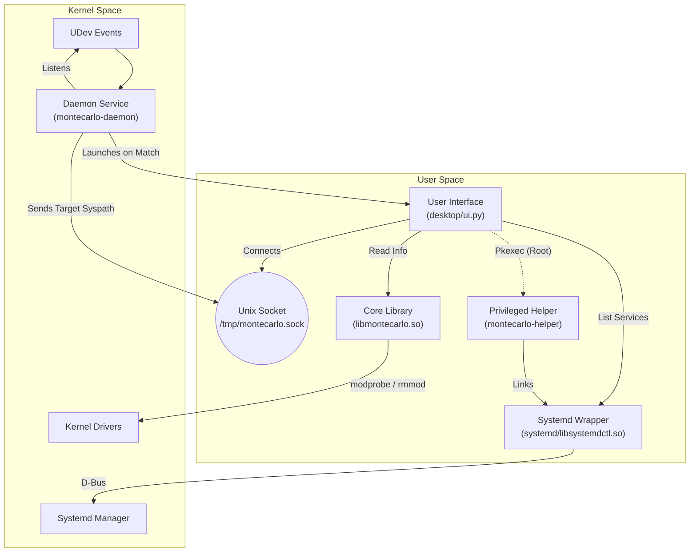

# Montecarlo Driver Manager

Montecarlo is a system utility designed for the management of Linux kernel modules and system services. It provides a unified interface to probe, load, and unload device drivers, incorporating safety protocols to prevent system instability.

The tool focuses on stability and transparency, helping users detect driverless devices and manage system resources without the risk of accidental module unloading or dependency bloat.

---

## Key Capabilities

### 🛡️ Active Safety System
Montecarlo enforces stability through a multi-layer safety engine:
*   **Dependency Protection**: Prevents the unloading of modules that are dependencies for other active drivers.
*   **Hardware Locking**: active hardware detection prevents the accidental unloading of drivers currently in use by peripheral devices.

### 🧠 Intelligent Filtering
The dashboard eliminates kernel noise to focus on relevant system components:
*   **Root Module Isolation**: Automatically filters internal kernel dependencies, displaying only user-relevant "Root Modules".
*   **Status Indicators**: Real-time status flags distinguish between `(In Use)` and `(Idle)` drivers, verified against hardware bindings.

### ⚙️ System Services Manager
Integrated systemd management allows for seamless control of background services directly from the driver dashboard:
*   **Privileged Control**: Authenticated Start, Stop, Enable, and Disable operations via PolicyKit.
*   **State Awareness**: Instant visual feedback on service health and runtime status.

### 🔍 Telemetry & Audit
Complete operational transparency is maintained through real-time auditing:
*   **Decision Logging**: Every decision made by the daemon—from device detection to driver verification—is logged.
*   **Event Tracing**: Trace the complete lifecycle of device events and driver interactions.

### ↩️ State Restoration
Montecarlo maintains a session-based history of all administrative actions:
*   **Driver Reloading**: Quickly restore accidentally unloaded modules.
*   **Service Recovery**: Restart services that were stopped during the current session.

---

## User Interface

### 1. The Dashboard
Your command center. View all loaded USB drivers in real-time. The list is filtered to remove kernel noise, focusing on the drivers that matter.


*Active drivers are verified against hardware bindings.*

### 2. Available Modules (Repository)
Don't know which driver to use? Browse your kernel's native module repository. You can search, filter, and load drivers dynamically to test compatibility.


*Search and load drivers specific to your kernel version.*

### 3. System Services (New)
Manage your standard linux services transparently. Montecarlo integrates with Systemd to show you what's running, failed, or inactive.
*   **Privileged Control**: Start, Stop, Enable, or Disable services using strict PolicyKit authentication.
*   **State Awareness**: Color-coded states to quickly identify failed or running services.


*Secure service management via PolicyKit.*

### 4. Telemetry & Logs
Transparency is key. Watch Montecarlo's decision-making process in real-time. See exactly what the daemon is doing, which devices are detected, and why a driver is allowed or blocked.


*Detailed audit log of all actions.*

### 5. Restore & History
Made a mistake? The Restore tab keeps a history of all modules unloaded during the session, allowing you to quickly reload them with a single click.


*Undo capabilities for driver management.*

---

## Architecture

The system consists of modular components: a C Daemon, a Python UI, a Shared Library, and a Privileged Helper.



## Installation and Testing

### Prerequisites
*   `gcc`, `make`
*   `libudev-dev`, `libsystemd-dev`
*   `python3`, `python3-gi`, `policykit-1` (GTK3)

### Build
```bash
# Clone the repository
git clone https://github.com/IRodriguez13/Montecarlo.git
cd Montecarlo

# Build All Components (Daemon, Libraries, Helper, CLI)
make
```

### Run Locally (Dev Mode)
To test the UI without installing the system service:

```bash
# Rebuild for development (sets RPATH)
make dev
```
*(The UI will launch automatically)*
## License

This project is licensed under the **GNU General Public License v3.0 (GPLv3)**.
